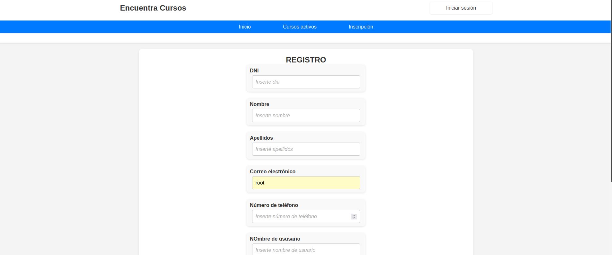
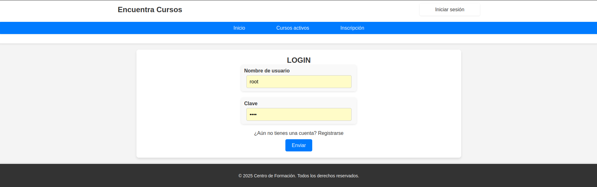
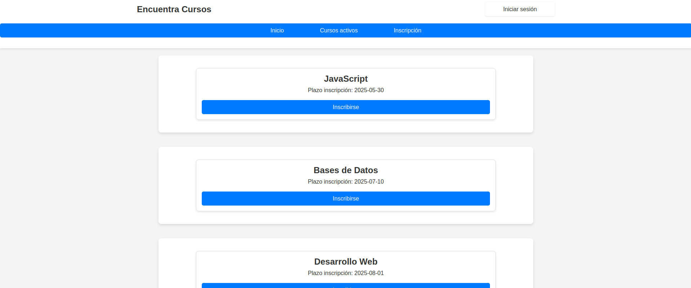
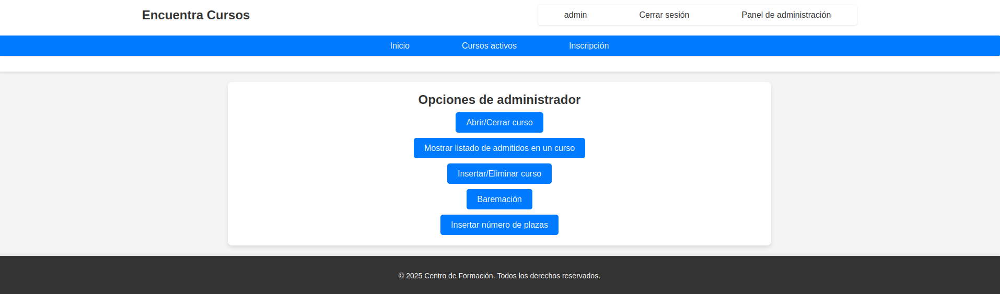
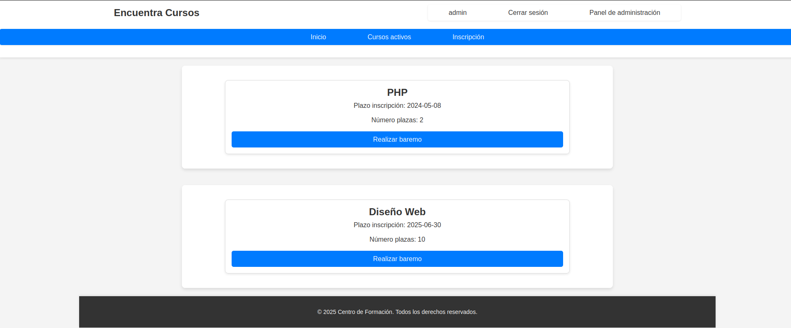
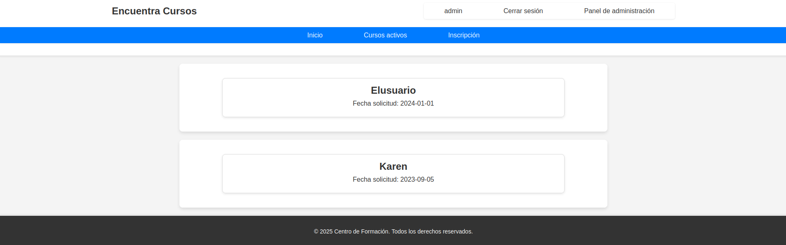
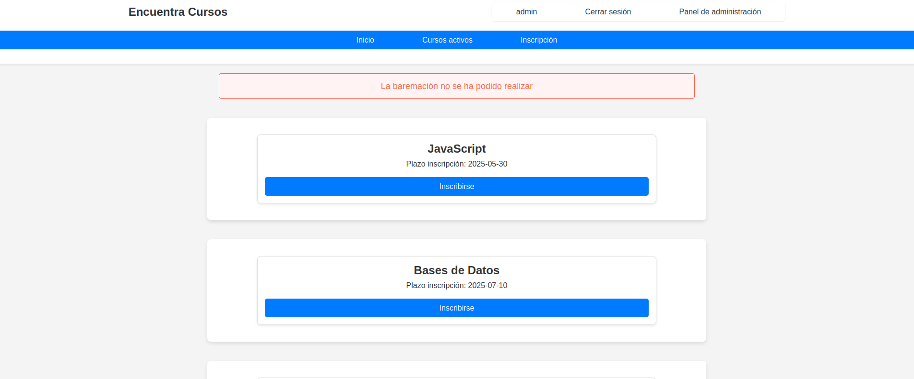

# 📚 Proyecto: Gestión de Cursos para Profesores

¡Bienvenido/a! Este repositorio contiene una aplicación web desarrollada en **PHP** para la gestión de cursos. El proyecto incluye funcionalidades tanto para usuarios como para administradores, permitiendo la inscripción, administración y baremación de cursos de forma eficiente.

---

## ✨ Descripción del Proyecto

La aplicación está diseñada para gestionar cursos dirigidos a profesores, incluyendo las siguientes funcionalidades clave:

### 🧑‍🎓 Funciones para los Usuarios:
- Registro e inicio de sesión mediante **formularios seguros**.
- Visualización de los cursos abiertos (aunque la inscripción esté cerrada).
- Inscripción en cursos disponibles:
  - Si el usuario ya se ha registrado previamente, sus datos se recuperan automáticamente para agilizar el proceso.
  - Sistema de puntuación basado en el formulario de inscripción.
- Persistencia de datos en la tabla **solicitantes** para futuras solicitudes.

### 👨‍💼 Funciones para el Administrador:
- Gestión completa de los cursos:
  - **Crear** y **eliminar** cursos.
  - **Abrir** y **cerrar** inscripciones.
  - Asignación de plazas disponibles para cada curso.
- Consulta y gestión de solicitudes:
  - Visualización de la lista de admitidos para cada curso.
  - Realización de la **baremación**:
    - Ordenar a los solicitantes de mayor a menor puntuación.
    - Admitir a los primeros solicitantes según el número de plazas disponibles.

---

## 🛠️ Tecnologías Utilizadas

- **Frontend**:
  - HTML5
  - CSS3
- **Backend**:
  - PHP
- **Base de Datos**:
  - MySQL (Base de datos: `cursoscp`)
- **Sesiones**:
  - Gestión de sesiones para usuarios y administradores.
- **Includes**:
  - Uso de `include` para mantener una estructura ordenada y modular del código.

---

## 🚀 Funcionalidades Detalladas

### 🧑‍🎓 Para los Usuarios
1. **Inicio de Sesión y Registro**:
   - Autenticación segura para acceder a las funcionalidades.
2. **Visualización de Cursos**:
   - Listado de todos los cursos disponibles en la página principal.
   - Si la fecha de inscripción ha finalizado, el usuario no podrá inscribirse.
3. **Inscripción Automática**:
   - Los datos del usuario se guardan tras la primera inscripción.
   - En futuras solicitudes, los campos se rellenan automáticamente.
4. **Puntuación en el Formulario**:
   - Los usuarios obtienen una puntuación según las respuestas del formulario.
   - Los puntos son almacenados en la tabla `solicitantes`.

### 👨‍💼 Para el Administrador
1. **Gestión de Cursos**:
   - Crear nuevos cursos y eliminarlos.
   - Abrir o cerrar inscripciones según las necesidades.
   - Establecer el número de plazas disponibles para cada curso.
2. **Baremación**:
   - Ordenar a los solicitantes de mayor a menor puntaje.
   - Asignar plazas según el número de vacantes.
3. **Consulta de Admitidos**:
   - Visualizar la lista de admitidos por curso.

---

## 🛒 Base de Datos

### 📁 Nombre de la Base de Datos: `cursoscp`

Tablas principales:
- **`usuarios`**: Contiene información sobre los usuarios registrados.
- **`solicitantes`**: Almacena datos de los usuarios inscritos, incluyendo su puntuación.
- **`solicitudes`**: Registra cada solicitud realizada por los usuarios para cursos específicos.
- **`cursos`**: Administra la información de los cursos, como fechas, plazas disponibles y estado (abierto/cerrado).

### 📖 Esquema de la Base de Datos:
Consulta el archivo `database/cursoscp.sql` para más detalles sobre la estructura y las relaciones.

---

## 🚀 Ejecución del Proyecto

### Requisitos:
1. **PHP 7.4 o superior**
2. **Servidor local** (como XAMPP, WAMP o MAMP).
3. **MySQL**.

### Configuración:
1. **Clona este repositorio**:
   ```bash
   git clone https://github.com/DannaPatricia/gestion-cursos.git
   cd gestion-cursos
2. **Importa la base de datos:**Accede a phpMyAdmin o usa el cliente MySQL:
   ```bash
   SOURCE database/cursoscp.sql;
3. **Configura la conexión a la base de datos:**Modifica las credenciales en conexion.php:
   ```bash
   $host = "localhost";
   $user = "tu_usuario";
   $password = "tu_contraseña";
   $dbname = "cursoscp";
4. **Inicia el servidor local:**Ejecuta XAMPP/WAMP y accede a http://localhost/gestion-cursos-php

---

## 📸 Capturas de Pantalla
 1. **Registro y login**:
<div align = "center">
   
</div>
<div align = "center">
   
</div>

 2. **Página principal**:
<div align = "center">
   
</div>

 4. **Opdiones de administrador**:
<div align = "center">
   
</div>

 5. **Formulario insertar curso**:
<div align = "center">
   
</div>

 6. **Menú baremación**:
<div align = "center">
   
</div>

 5. **Listado de baremación realizada**:
<div align = "center">
   
</div>

 6. **Uno de los mensajes de error disponibles**:
<div align = "center">
   
</div>

---

## 🤝 Contribuciones
1. **Realiza un fork del repositorio.**
2. **Crea una rama para tu funcionalidad**:
   ```bash
   git checkout -b nueva-funcionalidad
3. **Realiza los cambios necesarios y realiza un commit**:
   ```bash
   git commit -m "Añadida nueva funcionalidad"
4. **Haz push a tu rama**:
   ```bash
   git push origin nueva-funcionalidad
5. **Abre un pull request desde GitHub.**

---

## 📜 Licencia
Este proyecto está bajo la Licencia MIT. Puedes consultar más detalles en el archivo LICENSE.

---

¡Gracias por tu interés en este proyecto! 🚀


